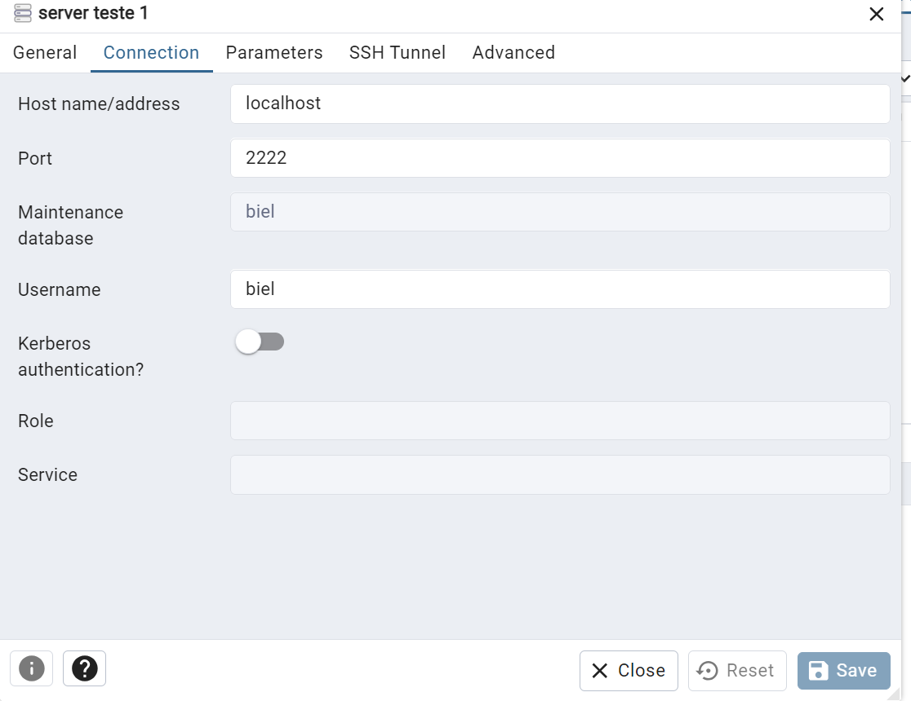

<!-- title -->
<h1 align="center">Criando um container com postgres</h1>

Para o PostgreSQL, geralmente não é necessário criar um Dockerfile personalizado, pois a imagem oficial do PostgreSQL já está disponível e é bem configurada para a maioria dos casos de uso. Você pode simplesmente baixar a imagem oficial do Docker Hub e criar um container a partir dela.

1. Baixamos a docker image do postgres

    ```bash
    docker pull postgres:latest; # ou alpine (versao mais leve)
    ```

<br>

2. Criar e rodar nosso container postgres

    ```bash
    docker run --name 'postgresContainer' -p 2222:5432 -e POSTGRES_USER=biel -e POSTGRES_PASSWORD=123 -d b781f3a53e61;
    ```

    - `docker run` --> vamos criar e startar um container
    - `--name` --> Setamos o nome do container
    - `-p` --> Conectamos uma porta local da nossa máquina com a porta exposta do container (Por padrao a porta do postgres é a **5432**)
    - `-e` --> Setamos o valor da environment variable, que no caso é a senha do banco
    - `-d` --> Vamos rodar o terminal do container em segundo plano

<br>

3. Acessamos o terminal do container

    ```bash
    docker exec -it postgresContainer /bin/bash;
    ```
    
    <br>

    📖 Para usar algum command no terminal do container, nós usamos o command `docker exec -it`.


    - `docker exec -it containerPostgres ls -lht;` --> Executamos um unico command no container
    - `docker exec -it containerPostgres bin/bash;` --> Abrimos o terminal do container

<br>
<br>

4. Pronto. Agora que estamos dentro do terminal do container, conseguimos usar o famoso `psql` command para acessar o banco de dados postgres.

    ```bash
    psql -h localhost -p 5432 -d biel -U biel;
    ```

    - `-h` --> servidor
    - `-p` --> porta
    - `-d` --> database
    - `-U` --> usuario postgres

<hr>
<br>


## Entrando no pgadmin

Agora que ja criamos nosso container, podemos usar o postgres tranquilamente.

Alem de gerenciar nossas tables e fazer nossas queries no terminal, podemos usar o pgadmin.

Basta baixar o pgadmin e criar um novo servidor:



Easy! 😎

⚠️ Importante lembrar que sempre que você quiser conectar o banco de dados do container com algum serviço da sua máquina local, **você precisa informar a porta local** que faz conexão com o container. Nesse caso, a porta **2222 local** se conecta com a **5432 do container**.

<br>

⚠️ Sempre que removemos um container, as databases / tables / dados são deletados. Para continuarmos com esses dados mesmo após deletar um container, precisamos trabalhar com **volumes**.